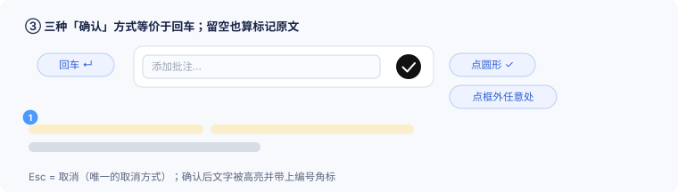
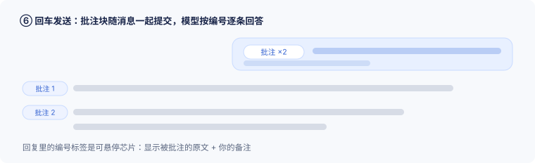

# dsh-annotation-zh · DSH 选中批注插件（**自用改版 / 自有版本线**）

> ## ⚠️ 先说清楚：本项目不是原创，是对他人开源作品的修改版
>
> 本仓库的代码**全部来自上游开源项目**，我们只是在它之上做了少量界面调整，并从此**独立维护、不再跟进上游**。
> 对原作者的尊重体现在：**原始来源、版本、提交号、许可与版权声明全部逐项列明，上游原文也完整留档**。
>
> | 项目 | 内容 |
> |---|---|
> | 上游仓库 | **https://github.com/omdsh-dev/dsh-annotation** |
> | 上游包名 | `@changfenhuang/dsh-annotation` |
> | 上游许可 | **MIT License** — `Copyright (c) 2026 omdsh-dev` |
> | 我们改版的基准 | 上游 **v1.4.11**，提交 **`14111b2`**（2026-10-04 获取） |
> | 本改版在 DSH 里的插件 id | `@changfenhuang/dsh-annotation`（沿用上游 id，便于复用其客户端注册；**未重命名**） |
> | 修改部分版权 | `Copyright (c) 2026 Niuniu-Sir` |
> | 上游原始文档留档 | [`docs/upstream/`](./docs/upstream/)（上游 README 原文，未改动） |
> | 上游更新日志留档 | [`CHANGELOG.upstream.md`](./CHANGELOG.upstream.md)（上游原文，未改动） |
> | 我们与原作者的差异 | [`patches/01-toolbar-position-and-label.patch`](./patches/01-toolbar-position-and-label.patch)（1 个文件、107 增 / 49 删，可逐行审） |
>
> **本项目为个人自用改版，与原作者无关联、未获原作者背书，也未使用原作者的名义或商标。**
> 如需原版或最新版，请前往上游仓库。若原作者认为本改版不妥，请联系我删除。

*English: An independent, self-maintained **modified version** based on the MIT-licensed upstream project [omdsh-dev/dsh-annotation](https://github.com/omdsh-dev/dsh-annotation) v1.4.11 (commit `14111b2`). Upstream credit, licence and original docs are preserved verbatim. Not affiliated with or endorsed by the original author. This repo does **not** track upstream updates.*

---

## 这个插件是干什么的

把「**在助手的回复里圈出一句话，就这一点说两句**」变成两个动作：**选中文字 → 打一句批注（也可以不打）**。
批注会攒在输入框旁边，**回车时随你的问题一起交给模型**，模型**按编号逐条回答你圈出来的每一处**。

**它对标的是 OpenAI Codex 智能体上的「选中批注」交互**——选文字、浮出小工具条、一行评论、编号回看。
唯一**有意去掉**的是 Codex 的「在侧边聊天中提问」（为某条批注单独开一路侧边对话）：**办公场景不需要再多开一条对话线**，我们要的是"在同一条主线里，被圈出来的每一点都被逐条回答"。

## 对标 Codex：我们保留了什么、去掉了什么

| Codex 的做法 | 本插件 | 说明 |
|---|---|---|
| 选中文字 → 浮出工具条 | ✅ 选中文字 → 浮出**单个「添加到对话」**工具条 | 只保留一个动作，不做"侧边聊天"入口 |
| 点「添加到对话」→ 一行评论输入框 + 圆形发送键 | ✅ **一行小框 + 圆形 ✓**（无标题、无 ✕） | 按使用习惯收得更紧 |
| 输入可选评论，回车确认 | ✅ **回车** / **点圆形 ✓** / **点框外任意处** 三种都算确认 | 多给了一种"手滑也能提交"的方式 |
| **留空**评论 = 只标记 | ✅ 留空也算一条批注（仅标记原文） | 只想要"这几句我要模型重视"时用 |
| 选区出现**编号角标**，可点击回看/修改 | ✅ 编号角标（蓝色圆形）+ 点它打开**编辑卡** | 编辑卡位置固定贴在原文正上方、不会移动 |
| 为某条批注**在侧边新开对话**提问 | ❌ **不做** | 办公场景不需要；直接在主线里按编号回答 |
| 回复里按编号逐条回答 | ✅ `Annotation 1: … / Annotation 2: …` 逐条回答 | 回复里的编号标签是**可悬停芯片**，显示原文 + 你的备注 |
| — | ➕ 侧栏**文件预览**里选正文/Markdown/代码也能批注（带文件路径） | 上游已有能力，保留 |

## 完整交互流程

> 以下为**示意图**（按真实实现的尺寸与配色绘制，SVG 矢量图）。真机截图放在 `docs/images/real/`（欢迎补充）。

### ① 选中文字 → 工具条出现在选区正上方


工具条是**单个按钮「添加到对话」**（没有 + 图标），浅黄底是批注高亮。

### ② 点「添加到对话」→ 只弹出一行小输入框


**无标题、无 ✕、无引文块**：只有一行输入 + 右侧圆形 ✓。框很窄，位置**永远紧贴选中文字的正上方**。

### ③ 三种「确认」方式等价于回车；留空也算标记



**回车**、**点圆形 ✓**、**点框外任意处**——三者完全等价（都走同一个保存逻辑）。
唯一的撤销方式：**Esc**。确认后文字被高亮，并带上编号角标。

### ④ 正文出现编号角标；输入框旁出现「批注 ×N」芯片


- 高亮：琥珀色半透明（`rgba(255,195,0,.15)`）
- 角标：蓝色圆形、白字（`#4c9aff`，16px）
- 芯片：输入框旁「批注 ×2」，**悬停**可看全部原文与备注、可**逐条删除**
- 批注**跨消息、跨轮次累积**（切会话/刷新后仍在）

### ⑤ 点编号角标 / 芯片 → 编辑卡


编辑卡包含：引文预览 + 多行输入 + **🗑 删除**（靠左）+ **取消** + **保存**（靠右）。
**位置固定在原文正上方，打开后不会移动**（禁用拖动、也不随滚动重算）。
删除有**两处**入口：编辑卡里的 🗑，以及对话里批注芯片列表中的删除。

### ⑥ 回车发送：批注块随消息提交，模型按编号逐条回答



批注块会**拼在你的问题前面**一起提交（你自己的气泡里会隐藏这段批注块，避免重复显示）；
模型按 `Annotation 1: … / Annotation 2: …` 逐条回答；回复里的编号标签**可悬停**查看"被批注的原文 + 你的备注"。

## 功能清单（v1.0.5 现状）

| 类别 | 能力 |
|---|---|
| 入口 | 助手回复里选中文字 → 工具条「添加到对话」；侧栏**文件预览**里选中正文/Markdown/代码同样可批注（带文件路径） |
| 新增批注 | 一行小框（无标题/无 ✕）；**回车 / 圆形 ✓ / 点框外** 三种确认；**留空**=仅标记原文；**Esc** 取消 |
| 标记 | 琥珀色半透明高亮 + 蓝色圆形编号角标（1、2、3…） |
| 汇总 | 输入框旁「批注 ×N」芯片；悬停看原文与备注；可逐条删除；跨消息、跨轮次累积 |
| 修改 | 点编号角标 / 芯片 → 编辑卡：引文预览 + 多行输入 + 删除 + 取消 + 保存 |
| 定位 | 弹框（新增框、编辑卡）**一律锚定选中文字正上方**；打开后**不移动、不可拖动** |
| 发送 | 回车随消息提交批注块；气泡内隐藏批注块（零闪烁）；模型按编号逐条回答 |
| 回复 | 回复里的 `Annotation N:` 标签渲染成**可悬停芯片**（原文 + 你的备注） |
| 语言 | 跟随 DSH 界面语言（zh / en / ru） |

## 设计取舍：有意不做的事

| 不做 | 原因 |
|---|---|
| **侧边新开对话**（Codex 的"在侧边聊天中提问"） | 办公场景不需要再开一路对话；主线里按编号逐条回答更清爽 |
| 新增框里显示引文块 | 文字就在眼前，引文块只会把框撑大（编辑态才显示，用于核对改的是哪段） |
| 拖动弹框 | 位置固定贴原文正上方；允许拖动反而会"框跑来跑去" |
| 新增框里的 ✕ | 打开就默认你要输入；反悔可 Esc，或事后再删除 |

## 已知限制

- 弹框位置按**打开那一刻**的选区计算；打开后若滚动页面，弹框**不会跟随**（这是"打开后不移动"的刻意结果）。
- 选区非常靠近窗口顶部、上方确实放不下时，弹框会临时放到选区下方。
- 只有界面半边（`client.js`）；Node 半边是空实现（`lib/index.js`），不做任何网络与文件访问。
- DSH 仍是 RC 版本，宿主内部插槽/主题变量变化时可能需要跟着适配。

## 本版改了什么（相对上游，v1.0.0 → v1.0.5）

1. **工具条位置**：改为**选区上方优先**（上游为"下方优先"，容易被系统原生选中菜单遮挡）。
2. **修掉一个坐标问题**：上游把工具条按 400px 宽的卡片来算水平位置，导致工具条被推到选区左侧、压住文字；本版改为按**选区左边缘**对齐。
3. **按钮文案**：`批注` → **`添加到对话`**；`已批注` → `已添加`（含悬停提示文字）。
4. **尺寸收紧**：工具条 padding `4px→2px`、按钮高度 `28px→24px`、左右内边距 `12px→9px`、图标 `14px→12px`。
5. **去掉按钮左侧的「+」图标**（v1.0.1）：按钮为纯文字「添加到对话」。
6. **工具条外边框改为女仆皮肤的深蓝**（v1.0.1）：`var(--maid-navy-800, #1c326b)`。
7. **批注编辑框紧凑化 + 尺寸封顶**（v1.0.2）：宽 `400→320px`、内边距 `12→8px`、标题 `13→12px`、引文区 `72→34px`、引文清单 `150→84px`、输入框最小高 `64→42px` 且**最大高 110px**。
8. **编辑框锚定到「选中文字正上方」**（v1.0.2）：按选区矩形与卡片实际高度定位，底边贴选区上方 8px；上方空间不足时改放选区下方。
9. **新增独立「删除」按钮**（v1.0.2）：编辑框底部的红色按钮——编辑已有批注时删除该条，新建批注时丢弃并关闭。
10. **新增批注只留一行小框**（v1.0.3）：标题留空、不显示引文块、输入框一行 26px、右侧圆形 ✓；**回车即确认**；底部按钮行隐藏。
11. **编辑批注保留完整卡片**（v1.0.3）：点编号/芯片打开，含引文 + 多行输入 + `🗑 删除`（左）+ `取消` + `保存`。
12. **样式补充**（v1.0.3）：`.dsh-ann-line` / `.dsh-ann-input-line` / `.dsh-ann-send` / `.dsh-ann-plain`。
13. **新增框去掉标题栏与 ✕**（v1.0.4）：只剩一行输入 + 圆形 ✓；回车即确认（留空也算标记）；反悔可稍后点编号/芯片删除。
14. **弹框定位修正**（v1.0.4）：编辑卡此前只记 `ui.pos` 未记选区矩形，会用旧坐标；现在新增与编辑**都锚定选中文字正上方**。
15. **位置固定**（v1.0.4）：移除拖动与滚动/尺寸重算，弹框打开后不再移动。
16. **点框外 = 回车**（v1.0.5）：新增框打开时，点框外任意处等效于回车（**确认保存**，留空也算标记）；**Esc 仍为取消**。

**未改动**：正文与其余主题颜色、圆角、按钮数量、发送格式（协议块）、锚点逻辑、界面语言与协议块；界面调整仅限上面第 5–16 条。

逐行差异见 [`patches/01-toolbar-position-and-label.patch`](./patches/01-toolbar-position-and-label.patch)。

## 版本线

- 本仓库从 **v1.0.0** 起**独立编号**，**不跟进上游更新**（上游后续版本不会自动合并进来）。
- 对应关系：**v1.0.0 = 上游 v1.4.11 + 上述改动**。
- 上游历史记录与原始说明都留档在仓库里（`CHANGELOG.upstream.md`、`docs/upstream/`），将来若需要手工移植上游某个修复，仍可对照。

## 安装

### DSH Web profile（CLI）

```sh
dsh plugin --profile web add github:Niuniu-Sir/dsh-annotation
```

### DSH 桌面端

桌面端的 `desktop` profile 由应用自有、不走 CLI profile 管理，安装方式为"把包放进 profile 的 `node_modules` 并把包名加入 `dsh.profile.bundles`"（或在 GUI 的 Plugins 面板安装）。安装后**需要重启 DSH**。

> ⚠️ **不要同时安装上游原版和本改版**：两者插件 id 相同、功能相同，同时存在会出现两条工具条。

## 使用速查

| 我想…… | 操作 |
|---|---|
| 圈一处并说两句 | 选中文字 → 「添加到对话」→ 输入 → **回车**（或点 ✓ / 点框外） |
| 只标记、不写字 | 选中文字 → 「添加到对话」→ 直接**回车** |
| 反悔 | 按 **Esc**（框还开着时）；已保存的批注则去删除 |
| 改一条批注 | **点正文里的编号角标**（或输入框旁的芯片）→ 编辑卡 → 保存 |
| 删一条批注 | 编辑卡里的 **🗑 删除**；或芯片列表里逐条删 |
| 看某条批注的原文/备注 | **悬停**芯片，或悬停回复里的编号标签 |
| 让模型逐条回答 | 正常**回车发送**即可；批注块会随消息一起提交 |

## 许可与署名

- 代码沿用上游 **MIT** 许可：[`LICENSE`](./LICENSE) **保持上游原文不变**（`Copyright (c) 2026 omdsh-dev`）。
- 本改版的修改部分版权：`Copyright (c) 2026 Niuniu-Sir`。
- 完整的来源、修改清单与免责声明见 [`NOTICE.md`](./NOTICE.md)。
- 本仓库自有更新记录见 [`CHANGELOG.md`](./CHANGELOG.md)。
